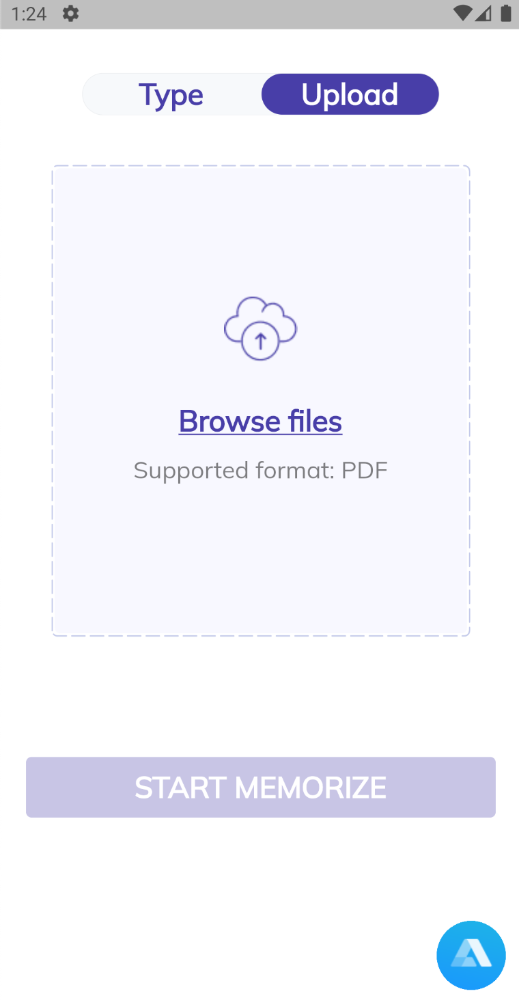
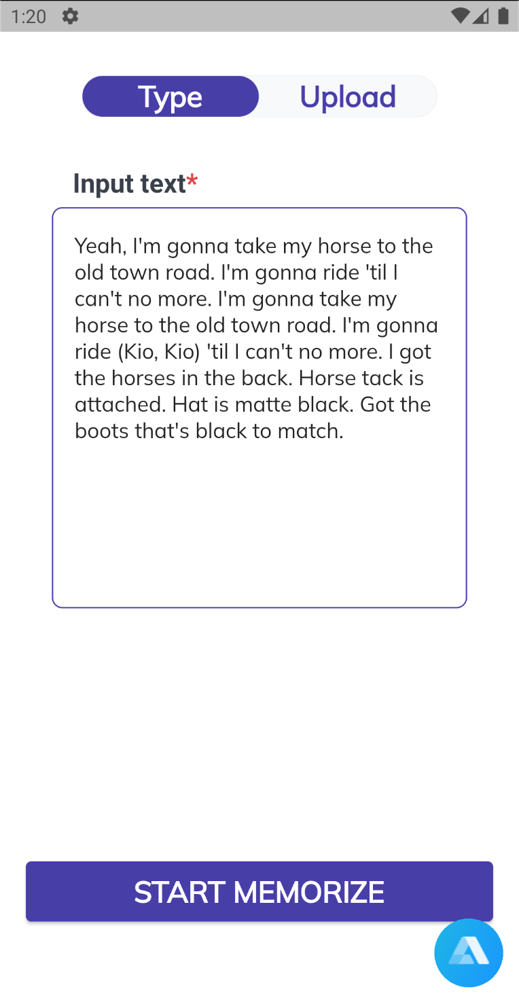
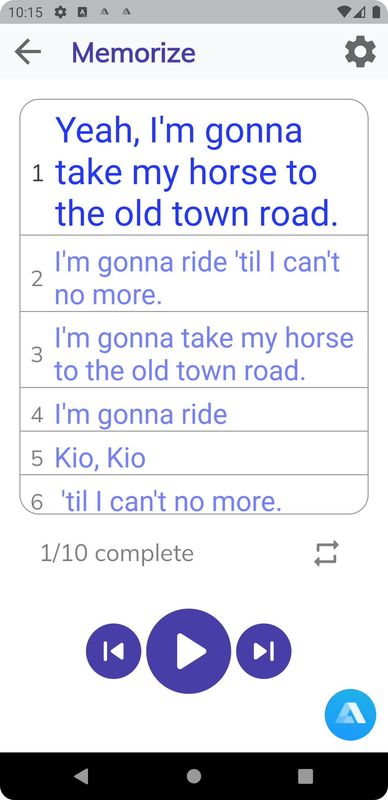

# InnoMemorizerApp 
___

IMP - an innovative open source application that will help people memorize text more easily \
 \
</h1>

___
## ⬇️ Available

## 📺 Demo video

___
## 🏠 Pages

### 📤 Upload page
Home page provides opportunity to choose one of two options to share certain text for the memorizing process with the app: it is possible to do it through the uploading text with clicking on the right top button with the word `Upload` then go to the square with the title `browse files` click on it and eventually upload the text on PDF format. Push `Start memorize` and enjoy the process.

### 📥 Type page 
Also it is possible to paste text by yourself. For that option it is needed to click on the left top button on the home page. Then go to the `Input text` spot and write certain text. After that and pushing the button `Start memorizing` app will do parsing and start the expected process.

## ✨ Memorizing page
The memorizing page shows title of the text and three sentences: previous, current, and next for convenient navigation. Using buttons on the bottom it is possible to sound current sentence several time, go back to the previous one, and go further by one sentence.

___
## 🔭 Used packages, libraries and APIs
- flutter/material
- flutter/services
- dio/dio
- alan_voice/alan_voice
- dart/convert
- toggle_switch/toggle_switch
- pdf_text/pdf_text
- file_picker/file_picker
- dotted_border/dotted_border
- shared_preferences/shared_preferences

___
## ✨ Features

| Feature                                       | Supported | 
|-----------------------------------------------|:---------:|
| Upload input text for memorize                |     ✅     |
| Upload pdf for memorize                       |     ✅     |
| Highlight current sentence                    |     ✅     |
| Add buttons to go to previous/next sentence   |     ✅     |
| Add buttons to pause/stop/repeat sentence     |     ✅     |
| Interface to write number of repeats          |     ✅     |
| Playback sentences for memorize               |     ✅     |
| Processing of voice commands via Alan platform|     ❌     |
| Adaptation of different voice tones           |     ❌     |
| Increased features in the app settings        |     ❌     |
| Add new memorize technic                      |     ❌     |

___
## Donate

